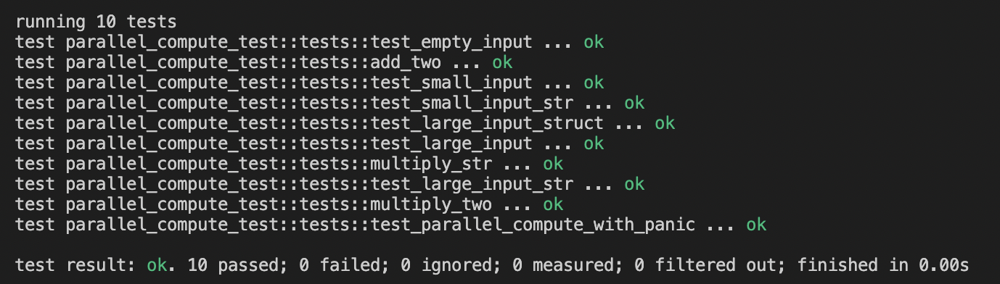

```
My task:
Implement basic function to split some generic computational work between threads. 
Split should occur only on some threshold - if computational work (input length) 
is shorter than this threshold, no splitting should occur and no threads should be created.
You get as input: 
1. Vec<T>
2. Function f(t: T) -> R
Threshold can be just constant. 

You should return:
1. Up to you, but probably some Vec of the same length as input(1)
 ```


## To start testing the function, you need to run the command:
```
cargo test
```
## Example:



##  Update:

```
My previous version could have ended incorrectly if an incoming short causes panic. Now, if 
the function f causes a panic, catch_unwind will intercept it and return Err. We use the ok() 
method to convert Result<R, Box<din std::any::Any + Send>> to Option<R>, where None means that 
a panic has occurred. Thus, instead of an emergency termination of the thread, the returned 
result will be None for the elements on which the panic occurred.
```

## Update #2: 
```
I changed the function to links. Now it is more efficient in terms of speed and memory.
```